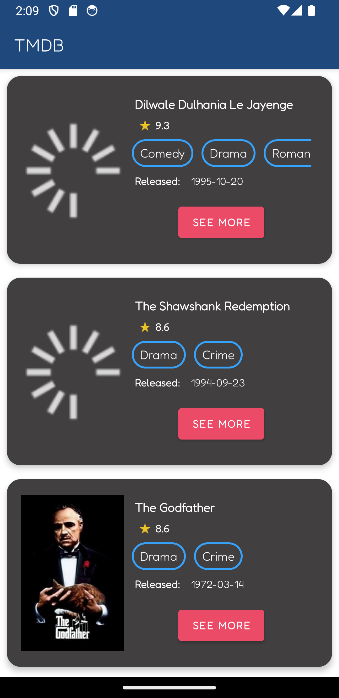

## App Android em Java

Desafio de estágio em Desenvolvimento Mobile da empresa Tokenlab, desenvolvido em Android/Kotlin

## Telas:

- Tela de listagem dos filmes: Nessa tela é realizada uma requisição para obter a lista de filmes

- Tela de detalhes de um filme: Nessa tela é realizada outra requisição para obter os detalhes de um
  filme clicado na tela anterior

## Arquitetura:

Clean Architecture + MVVM

## Principais bibliotecas:

- Retrofit
- Coroutines
- Glide
- Dagger2
- MockK

##

     
